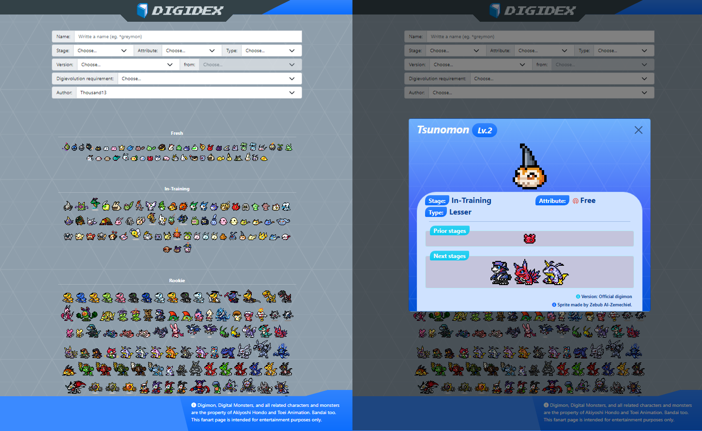

  

A fanmade visual guide for digimon and its evolutions

## 🔎 About

Digidex is a static page that compiles basic information about digimon like stages, attributes, types and more. This mini project is made with passion for all those people who like those creatures that once brought us joy playing its video games, card games, reading its manga or watching its anime. <a href="https://sergiogransol.github.io/digidex/" target="_blank">Show me page</a>

  

## 🚀 Features

* **Filters:** You can search for your favorite digimon using many filters.
* **Beautiful art:** Shown digimon are made in pixel art style by many talented artists.
* **Interactive database:** Click in every digimon you see to go to their bios.
* **Linked bios:** Click in evolutions to see their bios.

## 🤓 Creators

Support this project by following the work of these people, all of them allow me to use their art for this page.

**Artits**

- <http://giffactory.joeyteel.com/tiny/index.html>
- <https://www.deviantart.com/dragonrod342>
- <https://www.deviantart.com/sergiogransol>
- <https://www.deviantart.com/opdisk>
- <https://www.deviantart.com/topaz66>
- <https://www.deviantart.com/arcanin1412>
- <https://www.deviantart.com/neroesaurus>
- <https://www.deviantart.com/demo9ic>
- <https://www.deviantart.com/matykiller>
- <https://www.deviantart.com/sharkmon>
- <https://www.deviantart.com/maxtyrannus>
- <https://www.deviantart.com/scorcheddragonstudio>
- <https://dibujando.net/cadejowhite/galeria>
- <https://twitter.com/_VictoryD_>
- <https://twitter.com/extyrannomon>
- <https://twitter.com/thousand_13>

**Data origin**
- <https://digimon.net/reference/>
- <https://wikimon.net>
- <http://www.dma.wtw-x.net/>
- <https://digimon.fandom.com/wiki/Digimon_Wiki>
- <https://www.deviantart.com/vilmondigibits>

**Pragrammer**

- <https://github.com/SergioGranSol>

## 🚫 No good??

- If you consider I'm doing bad with found sprites, please let me know to remove it from this page

- Dont use sprites without give credits to authors, ask for it before

## 📍 Aboout digimon

Digimon, Digital Monsters, and all related characters and monsters are the property of Akiyoshi Hondo and Toei Animation. Bandai too. This fanart page is intended for entertainment purposes only.

## License

See the [LICENSE](https://github.com/SergioGranSol/digidex/blob/master/LICENSE) file.